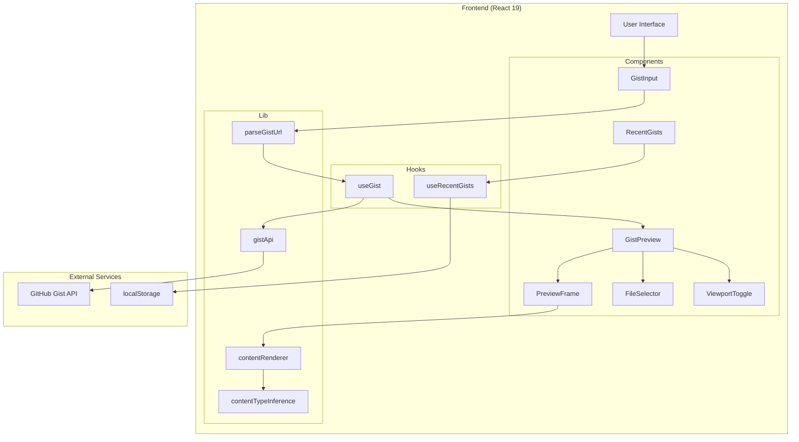
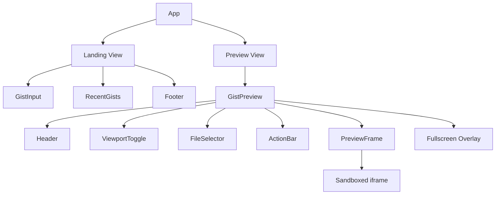
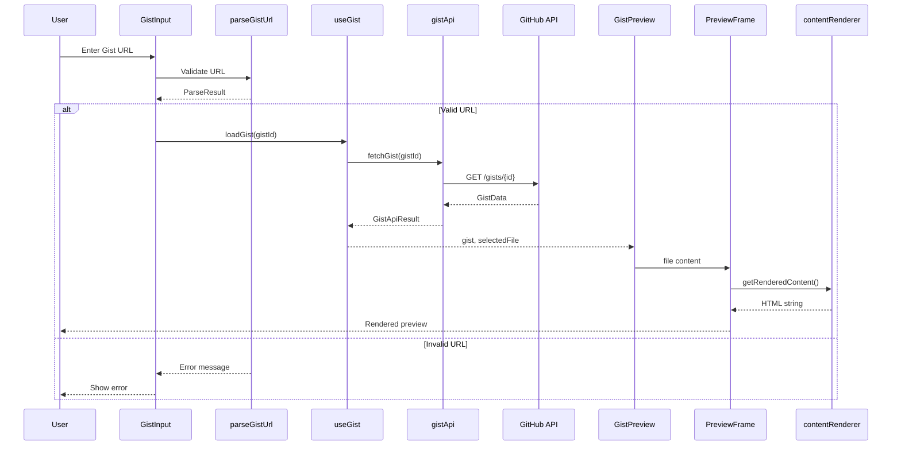
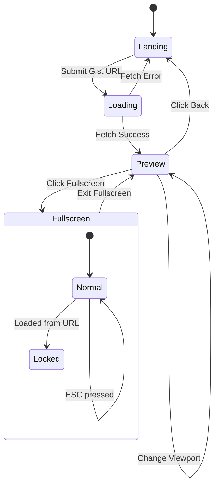
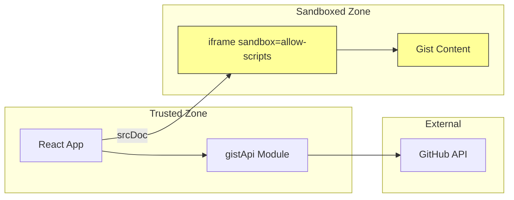

# Architecture Documentation

This directory contains high-level system architecture documentation, including diagrams and design overviews.

## Contents

- [System Architecture](#system-architecture)
- [Component Hierarchy](#component-hierarchy)
- [Data Flow](#data-flow)

## System Architecture

## Component Hierarchy

## Data Flow

## State Management

## Technology Stack

| Layer | Technology | Purpose |
|-------|------------|---------|
| Framework | React 19 | UI components and state |
| Language | TypeScript | Type safety |
| Bundler | Vite 7 | Development and build |
| Styling | Tailwind CSS 4.1 | Utility-first CSS |
| UI Components | shadcn/ui | Accessible primitives |
| Animations | Framer Motion | Smooth transitions |
| Icons | Phosphor Icons | Consistent iconography |
| Markdown | Marked | MD to HTML conversion |
| Testing | Vitest + RTL | Unit and component tests |
| CI/CD | GitHub Actions | Automated pipelines |

## Security Architecture

**Key Security Measures:**
- Gist content runs in sandboxed iframe (`sandbox="allow-scripts"`)
- No `allow-same-origin` prevents XSS attacks
- Content injected via `srcDoc`, not external URL
- No user data stored beyond localStorage

## Guidelines for Updating

When updating architecture diagrams:
1. Use Mermaid.js syntax (renders in GitHub)
2. Keep diagrams focused on one concept
3. Update when system design changes
4. Add explanatory text below diagrams
