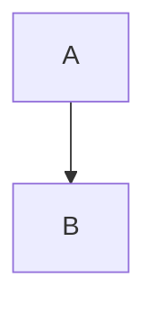

# Technical Specifications

This directory contains detailed technical specifications for features and systems in the GistPreview project.

## Purpose

Specifications serve as the **source of truth** for how features should work. AI agents must consult and update these specs when working on related code.

## Specification Index

| Spec | Description |
|------|-------------|
| [TECH_SPECS.md](../TECH_SPECS.md) | Comprehensive technical architecture and implementation details |
| [PRD.md](../PRD.md) | Product requirements and design decisions |

## When to Create a Spec

Create a new spec when:
- Implementing a significant new feature
- Making substantial changes to existing systems
- Documenting complex business logic
- Defining API contracts

## Spec Template

When creating a new specification:

```markdown
# [Feature Name] Specification

## Overview
Brief description of the feature/system.

## Requirements
- Functional requirements
- Non-functional requirements (performance, security, etc.)

## Design

### Data Structures
```typescript
interface Example {
  id: string;
  name: string;
}
```

### Flow Diagrams


### API Contracts
Endpoints, parameters, responses.

## Implementation Notes
- Key considerations
- Gotchas and edge cases

## Testing Strategy
- Unit test approach
- Integration test approach
- Manual testing checklist

## References
- Related ADRs
- External documentation
```

## Workflow

1. **Before coding**: Create or update the spec
2. **During coding**: Reference the spec for requirements
3. **After coding**: Update the spec if implementation differs
4. **On review**: Verify code matches spec
